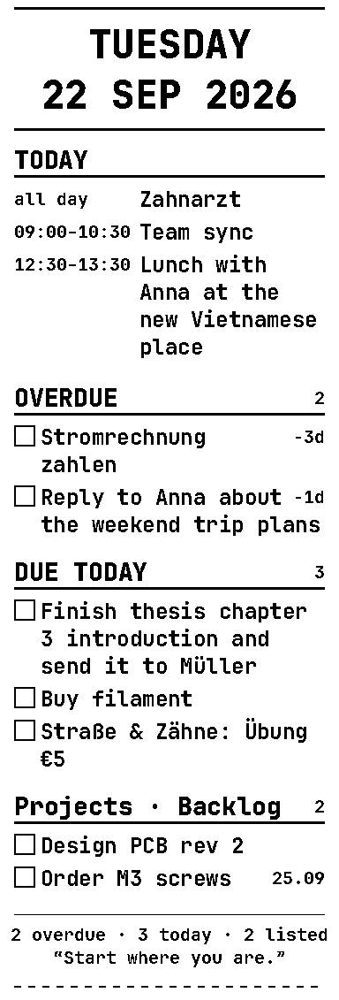

# Printcrastinator

**Your Nextcloud to-do list, printed on a thermal receipt every morning.**

Printcrastinator pulls today's tasks from Nextcloud Tasks and Deck plus today's calendar
events, renders them as a receipt with big checkboxes you can tick with a pen, and prints it
on a cheap 58 mm USB thermal printer. New tasks show up as a small slip a minute after you
create them. An interactive terminal view lets you cross tasks off, and a local AI or any MCP
client can manage tasks, events and the program's settings for you.

<p align="center"></p>

## Features

- **Daily receipt**, printed once per day when there is something to do: date header, optional
  logo and quote, today's events, then OVERDUE and DUE TODAY sections grouped by task list or
  Deck stack, with notes, tags and days-late markers. Two layouts: one continuous checklist,
  or "cards" with cut lines between tasks for scissors.
- **New-task slips**: the daemon polls Nextcloud and prints one slip listing everything new.
- **Interactive terminal view** (`pc`): today's events and tasks; click a task to complete it
  in Nextcloud, click again to reopen; print; talk to the AI.
- **On-screen agenda at login**: the daemon opens the terminal view and sends a desktop
  notification when the morning check runs, also after resume from sleep and screen unlock.
- **Local AI via Ollama**: morning briefing and natural-language control, fully offline:
  complete, reopen, edit and create tasks with all fields, create/edit/delete events including
  attendees and recurrence, print the receipt for any day, print filtered task lists, the
  calendar only, birthdays, saved lists and tickets, change settings, run printer tests.
- **MCP server** (`pc mcp`) exposing the same tools to Claude Code or any MCP client.
- **Web UI** on `127.0.0.1:8555` (single page, dark by default): credentials, task hiding,
  Deck stack and task list rules, calendar selection, extra calendars, logo upload, quotes,
  overdue filters, printer tuning, receipt previews, test buttons.
- **Birthdays** from Nextcloud's contact birthday calendar: on the receipt, in the notification,
  in the terminal view and known to the AI, with a configurable lookahead. The AI can also
  look up a contact and set or change its birthday.
- **Saved custom lists** (shopping list, packing list …) edited in the web UI or by the AI,
  printed as checklists whenever needed.
- **Tickets**: cinema/entry/voucher style tickets with a QR code, from the web UI or the AI.
- **Calendar-only prints**: one day as a timeline, or several days rotated side by side.
- **Extra calendars** beyond Nextcloud: ICS/webcal subscription links (e.g. a university
  timetable) or other CalDAV servers, with their own credentials.
- **Secrets in the system keyring** (KWallet, GNOME Keyring, any Secret Service provider);
  the config file only holds references. Encrypted vault fallback without a keyring.
- **Raster rendering**: 384 px wide 1-bit images with a heavy monospace font, no dithering,
  no code pages. Data is paced to the printer's speed so cheap printers don't reset.

## Hardware

Developed with a **Qian Anjet 58 mini** (USB ID `0456:0808`, generic ESC/POS, 384 dots, no
cutter). Any ESC/POS printer that the Linux `usblp` driver exposes as `/dev/usb/lp0` and that
accepts `GS v 0` raster images should work; adjust `printer.width_px` for 80 mm models.

## Requirements

- Arch-based Linux (EndeavourOS, Manjaro, Arch) with systemd user sessions and a desktop
  keyring (KDE's KWallet works out of the box)
- Python 3.13+ (installed by `uv` if missing)
- A Nextcloud account with the Tasks, Deck and Calendar apps
- Optional: Alacritty for the terminal window, libnotify for notifications
- Optional: [Ollama](https://ollama.com) with a tool-capable model (default `gemma4:12B`)

## Install

```sh
git clone <this repo> && cd Printcrastinator
./install.sh          # or ./install.sh --dev to symlink this checkout
```

The script installs `uv` and `libnotify` via pacman if missing, copies the sources to
`~/.local/share/printcrastinator`, installs a udev rule for the printer, enables the
`printcrastinator` systemd user service and puts the `pc` launcher into `~/.local/bin`.

Then open <http://127.0.0.1:8555>, enter your Nextcloud URL, username and an **app password**
(Nextcloud → Settings → Security → Devices & sessions; untick "Allow filesystem access"),
press *Test connection*, then *Save*. App passwords work even when your Nextcloud login goes
through an SSO provider. The password is stored in your keyring, not in the config file.

## Usage

```sh
pc                                     # interactive task view (alias for `printcrastinator show`)
pc --plain                             # static receipt-style output instead
pc print-today [--force] [--layout cards]
pc test-print [--sweep]                # calibration receipt, optionally a density sweep
pc preview out.png [--kind sample|empty|slip|live] [--layout list|cards] [--open]
pc notify                              # desktop notification
pc serve                               # daemon + web UI (run by systemd)
pc mcp                                 # MCP server on stdio
```

Register the MCP server in Claude Code: `claude mcp add printcrastinator -- pc mcp`

## Configuration

Everything is editable in the web UI; the TOML at `~/.config/printcrastinator/config.toml`
has these sections:

| Section | Keys |
|---|---|
| `nextcloud` | `url`, `username`, `app_password` (keyring reference) |
| `printer` | `device`, `width_px`, `band_lines`, `lines_per_second`, `feed_after_mm`, `density`, `fallback_codepage` |
| `daily` | `earliest_hour`, `print_calendar_only_days`, `layout`, `overdue_max_days`, `overdue_max_count`, `quote`, `quote_position`, `show_notes`, `notes_max_lines`, `show_birthdays`, `birthdays_calendar`, `birthdays_lookahead`, `group_by_list`, `show_list` |
| `slips` | `enabled_tasks`, `enabled_deck`, `debounce_seconds` |
| `server` | `host`, `port`, `poll_interval` |
| `screen` | `notify`, `terminal` |
| `ui` | `language` (`en` or `de`), `dark` |
| `logo` | `mode` (off/random/fixed), `file`, `max_height`, `dither` |
| `ai` | `enabled`, `url`, `model`, `num_ctx`, `max_tokens`, `think`, `summary_on_open` |
| `[[extra_calendars]]` | `name`, `kind` (ics/caldav), `url`, `username`, `password` (keyring reference) |

## Development

```sh
uv sync
uv run pytest                      # includes PNG snapshot tests; never touches the desktop or Nextcloud
uv run pytest --snapshot-update    # after intentional design changes
uv run ruff check . && uv run ruff format .
uv run printcrastinator preview /tmp/r.png --open
```

Project documentation is in [`docs/`](docs/):

| File | What it covers |
|---|---|
| [01-overview.md](docs/01-overview.md) | Goals, behaviour, decisions |
| [02-architecture.md](docs/02-architecture.md) | Process model, modules, data flow, stack |
| [03-receipt-design.md](docs/03-receipt-design.md) | Raster receipt layout, fonts, logo, layouts |
| [04-sources.md](docs/04-sources.md) | Nextcloud Tasks, Deck, Calendar, extra calendars, write-back, secrets |
| [05-daemon.md](docs/05-daemon.md) | Daily gate, polling, slips, wake triggers |
| [06-ui-and-cli.md](docs/06-ui-and-cli.md) | Web UI pages, HTTP API, CLI |
| [07-system-integration.md](docs/07-system-integration.md) | systemd, udev, install |
| [08-terminal-and-ai.md](docs/08-terminal-and-ai.md) | Terminal view, local AI, MCP server |

## License

MIT. Bundled font: JetBrains Mono (SIL Open Font License), see `src/printcrastinator/assets/fonts/`.
